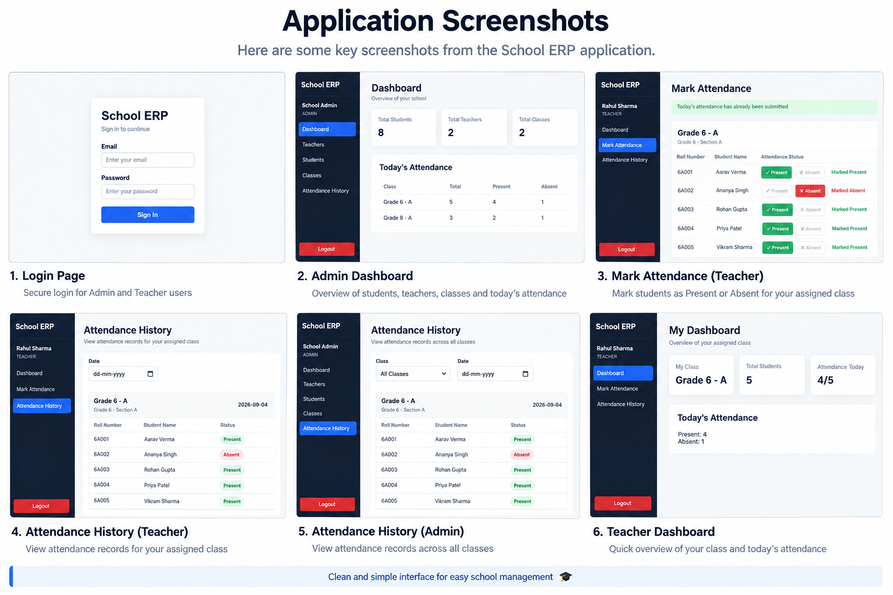

# School ERP

A simplified School ERP system built as a full-stack application for managing teachers, students, classes, and attendance.

The system supports two roles:

- Admin
- Teacher

It includes JWT authentication, role-based access control, teacher and student management, class management, attendance marking, attendance history, and a dashboard overview.

---

# Tech Stack

## Frontend

- React
- React Router DOM
- Axios
- CSS

## Backend

- Node.js
- Express.js
- MongoDB
- Mongoose
- JSON Web Token (JWT)
- bcryptjs

---

# Project Structure

```text
school-erp/
│
├── client/
│   ├── src/
│   │   ├── api/
│   │   ├── components/
│   │   ├── context/
│   │   ├── pages/
│   │   ├── App.jsx
│   │   └── main.jsx
│   │
│   └── package.json
│
├── server/
│   ├── config/
│   ├── controllers/
│   ├── middleware/
│   ├── models/
│   ├── routes/
│   ├── server.js
│   └── package.json
│
├── .gitignore
└── README.md

```

# Application Screenshots

## School ERP User Interface



# Installation and Setup

## Prerequisites

Make sure the following are installed on your system:

- Node.js
- npm
- MongoDB

---

## 1. Clone the Repository

    git clone https://github.com/Satyakush/school-erp.git

Move into the project directory:

    cd school-erp

---

# Backend Setup

Move into the server directory:

    cd server

Install dependencies:

    npm install

Create a `.env` file inside the `server` directory.

Example:

    PORT=5000
    MONGO_URI=your_mongodb_connection_string
    JWT_SECRET=your_jwt_secret

Start the backend server:

    npm run dev

If nodemon is not configured, use:

    npm start

The backend server runs on:

    http://localhost:5000

The API base URL is:

    http://localhost:5000/api

---

# Frontend Setup

Open another terminal.

From the project root, move into the client directory:

    cd client

Install dependencies:

    npm install

Start the frontend development server:

    npm run dev

The application will usually run at:

    http://localhost:5173

---

# API Endpoints

## Authentication

### Login

    POST /api/auth/login

Request body:

    {
      "email": "user@example.com",
      "password": "password"
    }

The API returns:

- JWT token
- User information
- User role
- Assigned class information where applicable

---

# Teacher Endpoints

    GET    /api/teachers
    POST   /api/teachers
    PUT    /api/teachers/:id
    DELETE /api/teachers/:id

Teacher management operations are restricted to Admin users.

---

# Class Endpoints

    GET    /api/classes
    POST   /api/classes
    PUT    /api/classes/:id
    DELETE /api/classes/:id

Class management is restricted to Admin users.

---

# Student Endpoints

    GET    /api/students
    POST   /api/students
    GET    /api/students/:id
    PUT    /api/students/:id
    DELETE /api/students/:id

Admin users can manage student records.

Teachers can retrieve students from their assigned class for attendance purposes.

---

# Attendance Endpoints

## Mark Attendance

    POST /api/attendance

Teacher access is required.

Example request body:

    {
      "classId": "class_id",
      "records": [
        {
          "student": "student_id",
          "status": "PRESENT"
        },
        {
          "student": "student_id",
          "status": "ABSENT"
        }
      ]
    }

---

## Get Attendance History

    GET /api/attendance

The attendance history supports filtering using query parameters such as:

    classId
    studentId
    date

---

# Dashboard Endpoint

    GET /api/dashboard

The dashboard provides:

- Total number of students
- Total number of teachers
- Total number of classes
- Today's attendance information

---

# Authentication Flow

The application uses JWT-based authentication.

The flow is:

    User Login
        ↓
    Email and Password Validation
        ↓
    Find User in Database
        ↓
    Compare Hashed Password
        ↓
    Generate JWT
        ↓
    Return Token and User Information
        ↓
    Store Token in Local Storage
        ↓
    Send Token with Protected API Requests

The JWT token is sent in the request header:

    Authorization: Bearer <token>

---

# Role-Based Access Control

The application supports two roles.

## ADMIN

Admin users can:

- Manage teachers
- Manage students
- Manage classes
- Assign teachers to classes
- View the dashboard
- View attendance history

## TEACHER

Teacher users can:

- View the dashboard
- Mark attendance for their assigned class
- View attendance history according to their access permissions

Teachers cannot access Admin-only management pages.

Both frontend routes and backend API routes are protected using role-based authorization.

---

# Attendance Rules

The following rules are implemented in the system:

1. Teachers can mark attendance only for their assigned class.
2. Attendance must be submitted for every student in the class.
3. A student's attendance status must be either:

    PRESENT

or:

    ABSENT

4. Duplicate attendance is prevented for the same class and date.
5. Teachers cannot access or mark attendance for another teacher's class.
6. The current date is automatically used when attendance is submitted.

---

# Database Design

The application uses MongoDB with Mongoose schemas.

## User

The User model stores:

- Name
- Email
- Password
- Role
- Phone
- Subject
- Assigned class

Roles include:

    ADMIN
    TEACHER

Passwords are hashed before being stored in the database.

---

## Class

The Class model stores:

- Name
- Grade
- Section
- Class teacher

The combination of grade and section is kept unique.

---

## Student

The Student model stores:

- Name
- Roll number
- Class
- Guardian contact

The roll number is unique.

---

## Attendance

The Attendance model stores:

- Class
- Date
- Student attendance records

Each attendance record contains:

- Student
- Status

The combination of class and date is unique to prevent duplicate attendance entries.

---

# Security

The application includes the following security measures:

- Password hashing using bcryptjs
- JWT authentication
- Protected backend routes
- Role-based authorization middleware
- Passwords are not returned in API responses
- Teachers are restricted to their assigned class for attendance operations

---

# Why This Tech Stack?

## React

React was used for the frontend because its component-based structure makes it suitable for building reusable pages and managing role-based user interfaces.

React Router is used to handle navigation and protected routes.

Axios is used for communication between the frontend and backend.

---

## Node.js and Express.js

Node.js and Express.js were used to build the REST API.

They provide a straightforward structure for:

- Routing
- Middleware
- Authentication
- Authorization
- CRUD operations
- Request and response handling

---

## MongoDB and Mongoose

MongoDB was selected because the application data can be modeled effectively using document-based collections.

Mongoose provides:

- Schema definitions
- Validation
- Relationships using ObjectId references
- Query helpers

---

## JWT

JWT was used for authentication because it provides a simple stateless approach for protecting API routes.

The token contains the user's identifier, while user information is retrieved and validated through protected requests.

---

# What I Would Improve With More Time

With additional development time, I would add:

## Student and Parent Access

- Student login
- Parent login
- Read-only attendance access

## Search and Filtering

- Search students by name or roll number
- Search teachers by name or subject
- Improved filtering options

## Attendance Analytics

- Student attendance percentage
- Monthly attendance reports
- Attendance charts
- Class-level attendance analytics

## Export Functionality

- Export attendance records to CSV
- Download reports

## Testing

- Unit tests
- API integration tests
- Frontend component tests

## Scalability Improvements

- Pagination for large lists
- More detailed validation
- Centralized error handling
- Better loading states
- Improved API response structure

## Production Improvements

- Environment-specific configuration
- Deployment to cloud infrastructure
- Production database configuration
- Logging
- Monitoring

---

# Assignment Requirements Coverage

## Authentication and Roles

- Login with email and password
- Admin role
- Teacher role
- Password hashing
- Role-based access control

## Staff and Teacher Management

- Add teachers
- Edit teachers
- Delete teachers
- View teacher list
- Store name, email, phone, subject and assigned class

## Student Management

- Add students
- Edit students
- Delete students
- View student list
- Assign students to classes
- Store name, roll number, class and guardian contact

## Class Management

- Create classes
- Create sections
- Assign class teachers
- Assign students to classes

## Attendance

- Mark Present
- Mark Absent
- Mark attendance for the current date
- Restrict teachers to their assigned class
- Prevent duplicate attendance
- View attendance history
- Filter attendance records

## Dashboard

- Total students
- Total teachers
- Total classes
- Today's attendance summary

---

# Future Enhancements

Possible future enhancements include:

- Student and parent portal
- Attendance percentage charts
- CSV export
- Search functionality
- Automated tests
- Advanced reporting
- Notifications
- Mobile-first UI improvements

---

# Notes

This project was developed as a simplified School ERP system with a focus on the core requirements of the assignment.

The main focus areas were:

- Role-based authentication
- Secure password handling
- CRUD operations
- Class and teacher assignment
- Student management
- Attendance management
- Attendance history
- Dashboard overview
- Clean REST API structure
- Usable role-based frontend interface
